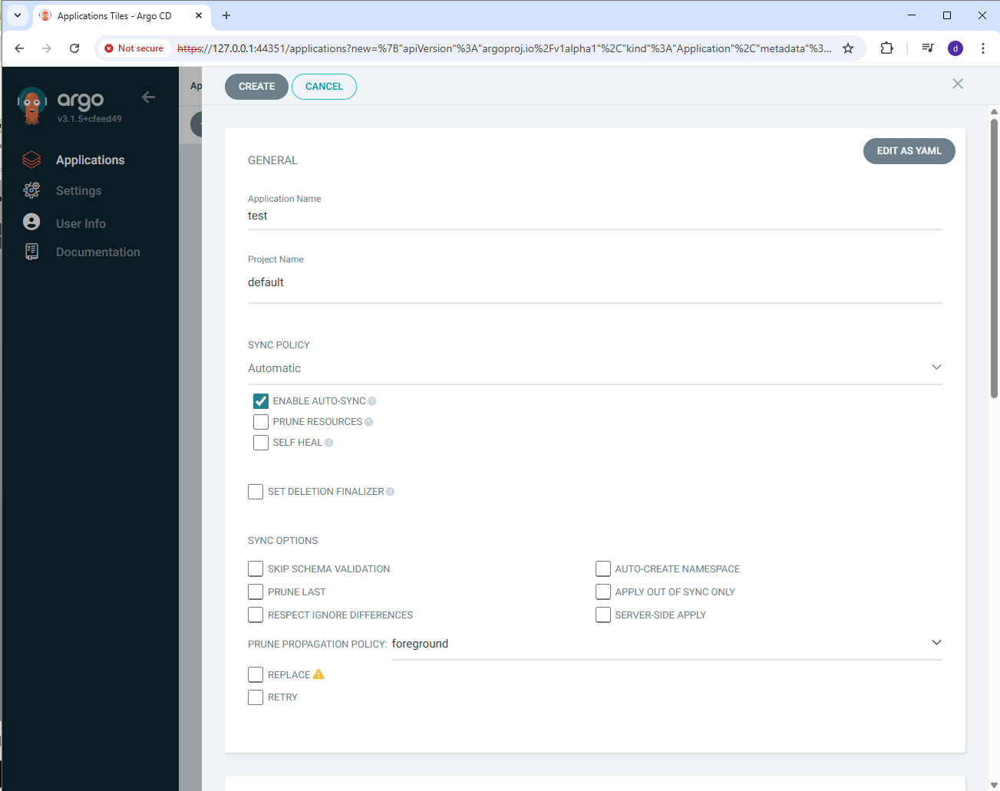
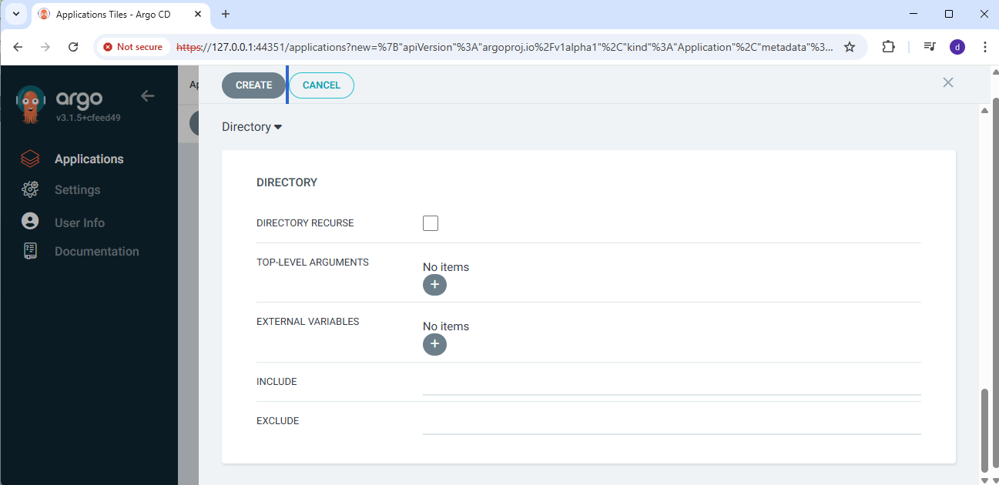

# docker-Java-kubernetes-project
Deploying Java Applications with Docker and Kubernetes

Credit: https://github.com/danielbryantuk/oreilly-docker-java-shopping/

Pre-requisite
Java 8

Setting up ArgoCD for CD part
Go to https://operatorhub.io/operator/argocd-operator

Install on Kubernetes (I use minikube cluster on my laptop)

1.Install Operator Lifecycle Manager (OLM), a tool to help manage the Operators running on your cluster.
$ curl -sL https://github.com/operator-framework/operator-lifecycle-manager/releases/download/v0.38.0/install.sh | bash -s v0.38.0

2.Install the operator by running the following command:
$ kubectl create -f https://operatorhub.io/install/argocd-operator.yaml

3.Install ArgoCD controller
#The following example shows the most minimal valid manifest to create a new Argo CD cluster with the default configuration.

vi argocd-basic.yml
apiVersion: argoproj.io/v1alpha1
kind: ArgoCD
metadata:
  name: example-argocd
  labels:
    example: basic
spec: {}

kubectl apply -f argocd-basic.yml

Make Argo cd accessible from UI
kubectl get argocd
kubectl edit argocd example-argocd  and then change to
spec:
  server:
    service:
      type: NodePort

kubectl get svc 
example-argocd-server service ClusterIP changed to NodePort

To get the URL to access ArgoCD
$minikube service example-argocd-server
$minikube service list

To get ArgoCD UI , admin password
$kubect get secrets
$ kubectl get secrets example-argocd-cluster -o yaml

In ArgoCD UI , create application (Choose namespce: default)

